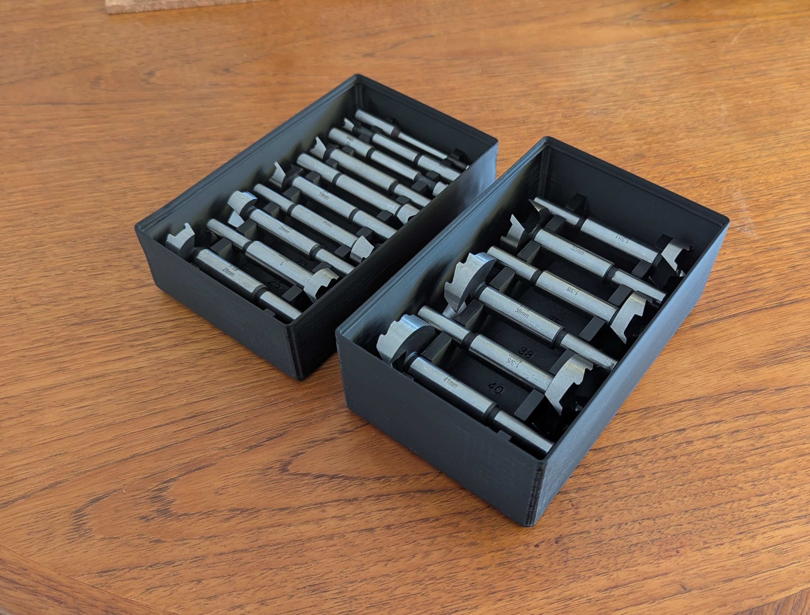
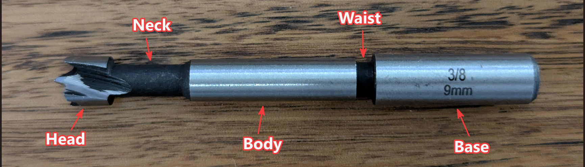
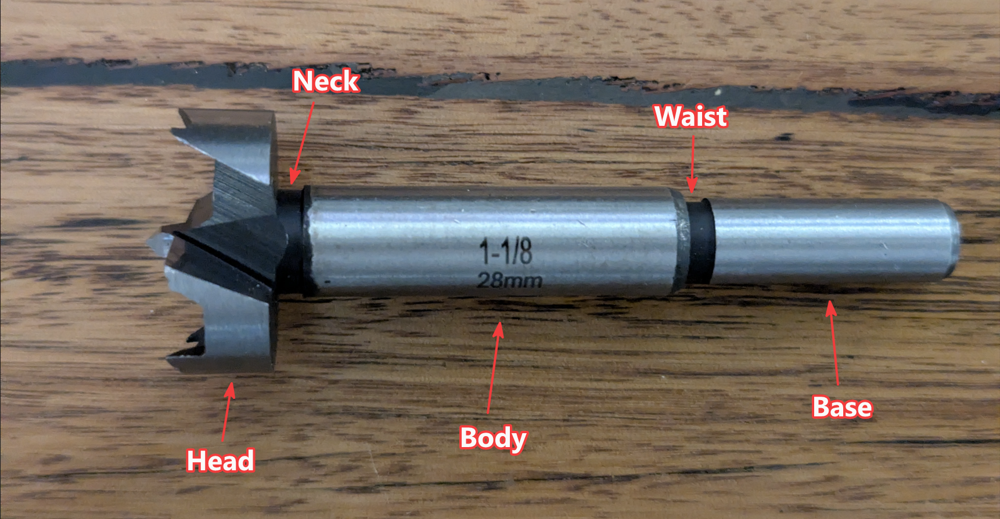
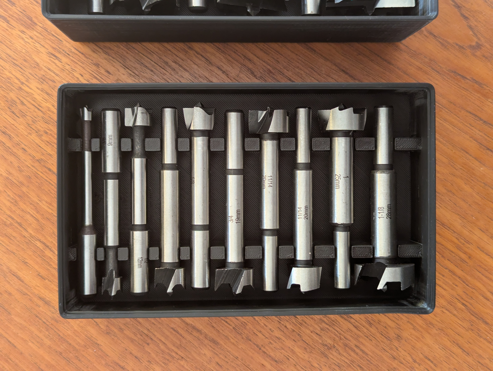
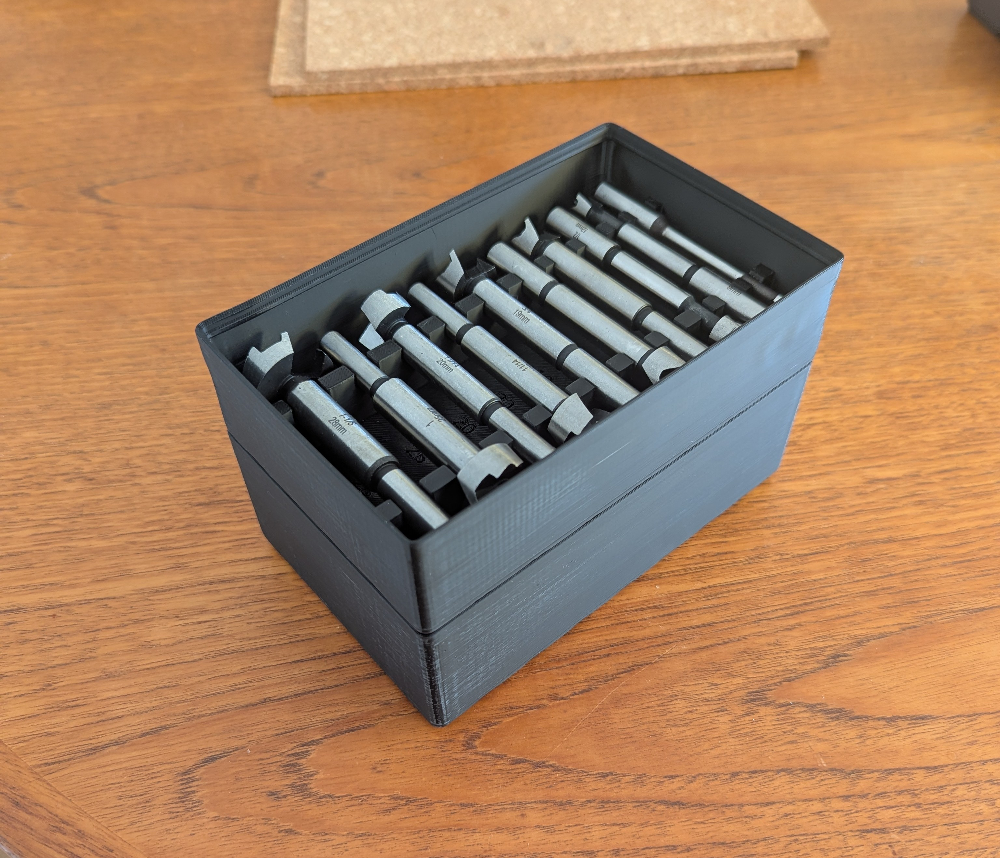
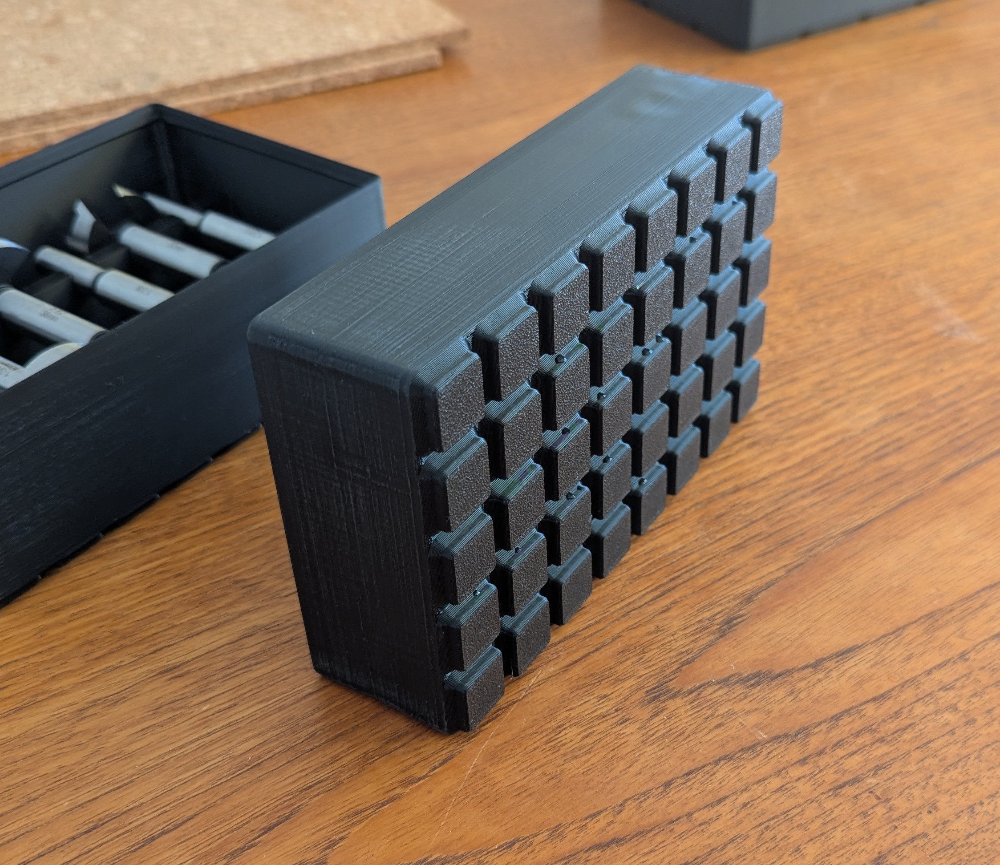
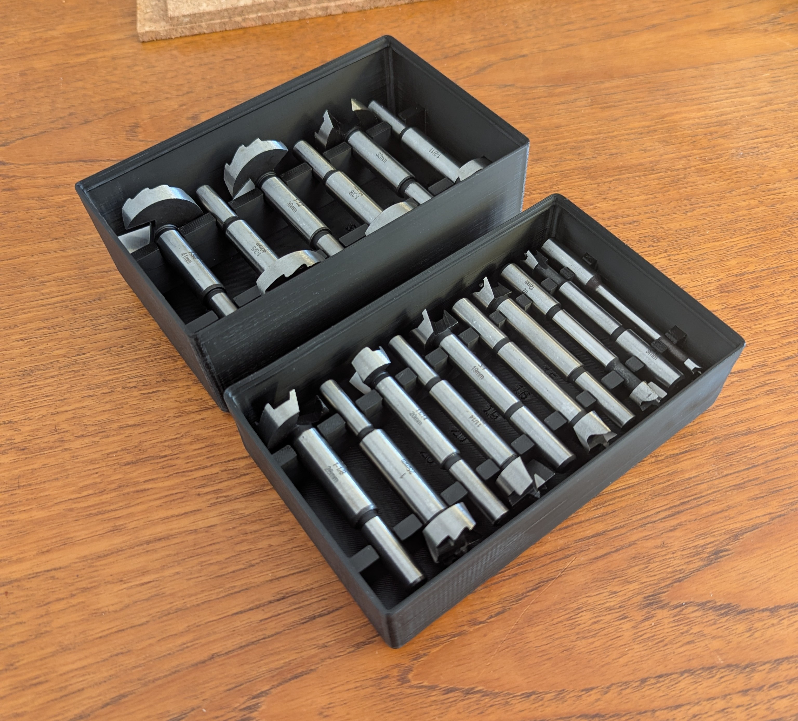
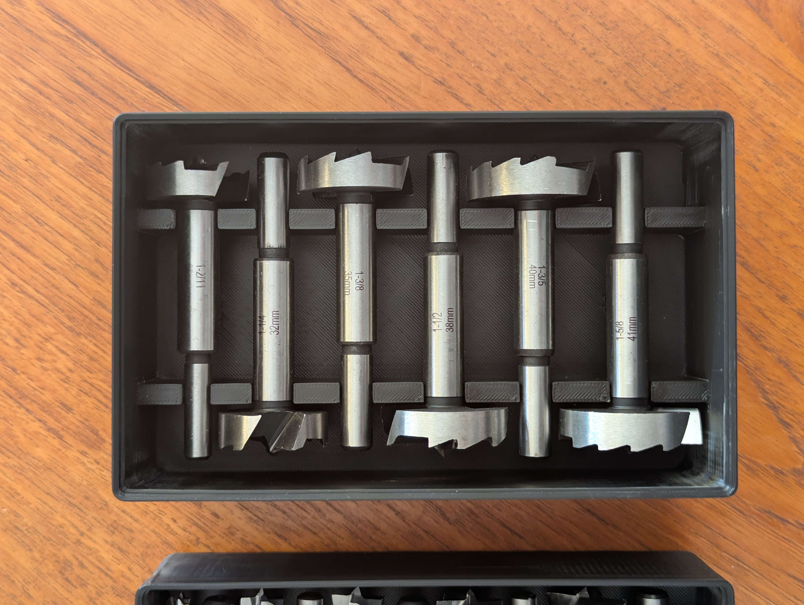
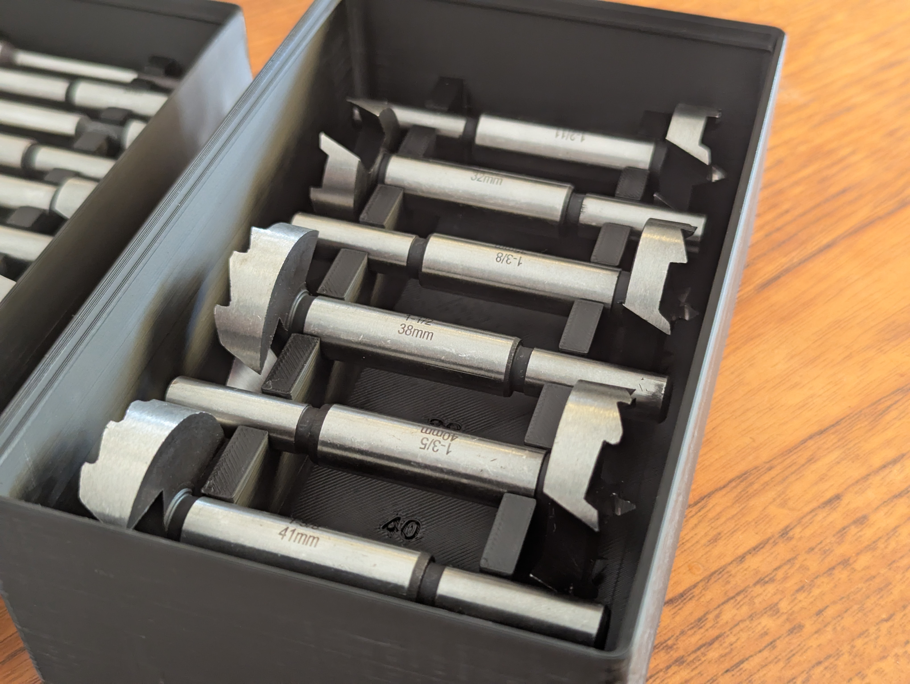

# gridfinity-forstner-drill-bits-openscad

Parametric Gridfinity bin for Forstner drill bits. Bits lie flat in an open
tray, cradled by two notched rails, alternating head-to-tail ("top and
tail") so each bit's head sits next to a neighbour's narrow shaft — packing
the set far tighter than standing them upright would.

Built on [kennetek/gridfinity-rebuilt-openscad](https://github.com/kennetek/gridfinity-rebuilt-openscad)
for the base profile, stacking lip, walls, and magnet/screw holes. This repo
only adds the rail geometry that cradles the bits.

Inspired by [PabloFernandez](https://www.printables.com/@PabloFernandez)'s
[Gridfinity Bins for Forstner Drill Bits](https://www.printables.com/model/870351-gridfinity-bins-for-forstner-drill-bits)
on Printables.



## Setup

The library is a git submodule, so clone with `--recurse-submodules`:

```bash
git clone --recurse-submodules https://github.com/xphir/gridfinity-forstner-drill-bits-openscad.git
```

If you already cloned without that flag:

```bash
git submodule update --init
```

Open `gridfinity_forstner_flat_lib.scad` in [OpenSCAD](https://openscad.org/).

## Usage

The bit list is up to 20 slots (`bit_01_*` through `bit_20_*`), each with its
own `enabled` checkbox — flip a slot on and fill in its dimensions to add a
bit, or leave it off to skip it. Out of the box, only 5 slots are enabled
with generic round sizes (10/15/20/25/30 mm) as a working example — replace
them with your own measurements, or load a known set via **Preset**. All
dimensions are in mm, measured from the head end downwards, five sections
per bit:

- `head_diameter` / `head_length` — the cutting head, the widest part
- `neck_diameter` / `neck_length` — short narrow transition right below the head
- `body_diameter` / `body_length` — the main shaft (most of the bit's length)
- `waist_diameter` / `waist_length` — narrow retention groove just above the shank
- `base_diameter` / `base_length` — the shank that goes in the chuck




Only `head_diameter` needs a value on every enabled bit. Everything else
defaults to `0`, which means "use the matching `default_head_length` /
`default_body_diameter` / etc. value" in the **Bit defaults** section —
handy since most forstner sets share the same head length and shank across
many sizes. Give a bit a non-zero value in any of those fields to override
the default just for that one bit (e.g. if its shaft is a single constant
diameter, set that bit's `base_diameter` equal to its `body_diameter`).

Each bit also has a `mountN` field (`false` = body, `true` = neck), which
picks which of those two diameters actually grips that bit's rails. Most
bits should stay on `body`; switch a bit to `neck` if its body is short or
oddly proportioned next to its neighbours (a small bit whose neck is
proportionally long next to its shank, for example) — the model will warn
in the console if neither rail actually lands on the chosen section.

This scalar-per-field format (rather than a table or list) is deliberately
the most restrictive customizer-compatible shape there is, so it has the
best chance of showing up as editable fields both in the OpenSCAD Customizer
and in MakerWorld's parameter panel — neither reliably renders list-type
parameters.



Everything else — bin footprint, height, rail spacing, magnet/screw holes,
labels — auto-sizes from the enabled bits, or can be overridden in the
Customizer. See the comments in `gridfinity_forstner_flat_lib.scad` itself
for the full parameter reference.

### Known bit sets

The **Preset** dropdown can load a known set's measurements into the bit
fields for you (currently just the VEVOR 16-piece set). A preset only fills
in *sizes* — one preset row per slot — it never touches the `enabled`
checkboxes, so you can still turn individual slots on/off same as with a
hand-entered list. Pick `None` to go back to editing the fields yourself.

### Splitting a large set across multiple prints

A full 16+ bit set makes for a long tray and a long print. Since rail
spacing is shared across every enabled bit, splitting the set into two
prints — rather than just picking a smaller `grid_x`/`grid_y` — keeps each
print's rail spacing tuned to a narrower size range instead of being
stretched to fit both your smallest and largest bits at once. It also
just plain fits more printer beds — a single tray sized for a full 16+
bit set can easily be longer than many printers' build volume. With the
VEVOR set, for example: enable bits 1–10 for one print, then 11–16 for a
second, by flipping the rest off in **Enabled bits** (works the same way
whether you're using the preset or a hand-entered list).



### Half-grid footprint

Set `allow_half_units` (in **Bin**) to size the tray in 21 mm half-units
instead of full 42 mm Gridfinity units, for a tighter footprint when a
full unit per row would waste space. It still snaps onto a standard
Gridfinity baseplate.



### Testing grip/fit before committing to a full print

Set `test_bit` (in **Testing**) to a slot number to render a small, fast
coupon instead of the whole bin — just enough rail to test-fit that one
bit and feel whether the retention pinch actually grips. Much quicker than
re-printing the full tray while dialing in `slot_clearance` and
`grip_pinch` for your printer/filament. Worth doing even with the default
`slot_clearance` — the right value depends on your printer and filament,
and is cheap to check with the coupon before committing to a full tray.

## Gallery





## Status

Verified to compile to a clean manifold solid. First real test print
confirmed the flat-lay/top-and-tail layout works and the retention pinch
gives a real click. At the default `slot_clearance` (0.05 mm) bits click
in and hold well — even fully upside down, nothing falls out — but it can
be a little tight to pull bits back out; try 0.1 mm if you'd rather have
easier removal at the cost of a slightly less snug hold. Use `test_bit` to
check either value on your own printer before committing to a full tray.

Printed in [Siddament Black PLA+](https://siddament.com.au/products/black-pla-1)
on a 0.4 mm nozzle, 0.2 mm layers, Arachne walls, 3 wall loops, 15% gyroid
infill. Some stringing showed up in corners, most likely from damp
filament rather than the model or slicer settings. A ready-to-slice
[`profiles/vevor-16-bit-set.3mf`](profiles/vevor-16-bit-set.3mf) is
included for the VEVOR 16-piece set as a starting point.

The VEVOR preset's dimensions come from a real set; anything you enter by
hand should still be measured against your own bits before printing.

## License

MIT — see [LICENSE](LICENSE). The bundled `gridfinity-rebuilt-openscad`
submodule is separately licensed (also MIT) by its own authors.
